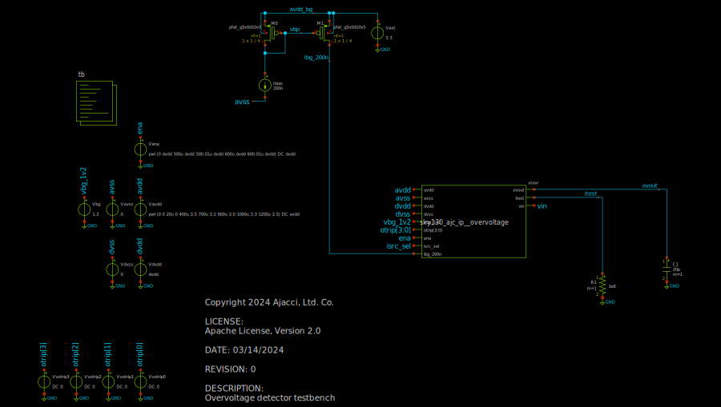

# sky130_ajc_ip__overvoltage
Overvoltage detector for SKY130

This circuit is designed to produce an alarm signal `ovout` (asserted high) when 
the power supply `avdd` is rises above a selectable trip voltage via `otp[3:0]`,
ranging from 3.3V to 5.5V.

To clone this repository:

`git clone https://github.com/ajcci/sky130_ajc_ip__overvoltage`

To view a schematic after cloning the repository:

```
cd sky130_ajc_ip_overvoltage
xschem xschem/sky130_ajc_ip__overvoltage_tb.sch
```



To run CACE to see simulation results against a set of [specifications](https://github.com/ajcci/sky130_ajc_ip__overvoltage/doc/sky130_ajc_ip__overvoltage.html), run CACE
at the base (current directory):

`cace-gui`

