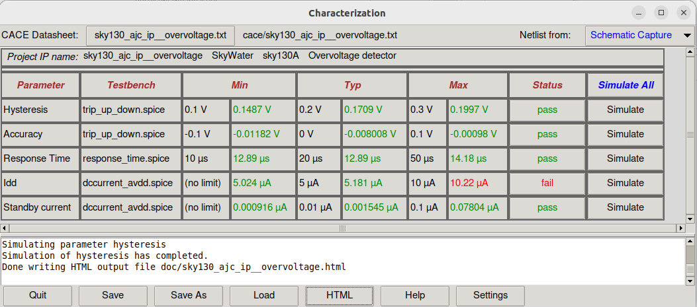
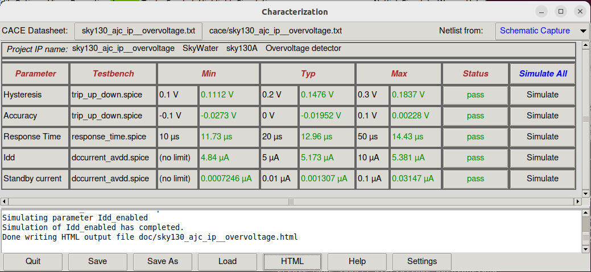

# sky130_ajc_ip__overvoltage
Overvoltage detector for SKY130

This circuit is designed to produce an alarm signal `ovout` (asserted high) when the power supply `avdd` is rises above a selectable trip voltage via `otrip[3:0]`, ranging from 3.3V to 5.5V.

To clone this repository:

`git clone https://github.com/ajcci/sky130_ajc_ip__overvoltage`

To view a schematic after cloning the repository:

```
cd sky130_ajc_ip__overvoltage
xschem cace/dccurrent_avdd.sch
```

Run CACE to see simulation results against a set of specifications:

`cace-gui`




## Layout
The layout was drawn in Magic, so it is best viewed and edited in Magic.

Open layout using Magic by typing the following in the `mag` directory:

`magic -d XR -rcfile $PDK_ROOT/$PDK/libs.tech/magic/sky130A.magicrc sky130_ajc_ip__overvoltage.mag`

Alternatively, if using Klayout, in base directory, enter the following in the terminal:

`klayout -e gds/sky130_ajc_ip__overvoltage.gds`


Layout of `sky130_ajc_ip__overvoltage`, approximate size is 230um x 165um sq.

## Design-Rule-Check (DRC)
DRC is automatic in Magic.  Design passes all rules in Magic except the 'MV diffusion spacing rules'.  However, according to Tim Edwards at eFabless Inc., these are not actual violations and are false positives, see picture below.


DRC rule violations that are false positives (not actual violations) related to 'MV diffusion spacing'

Check the design using Klayout sky130 DRC deck for consistency:
1. In the Magic Tcl interpreter, run `gds write sky130_ajc_ip__overvoltage.gds` to stream out a gds file from Magic.
2. Load `sky130_ajc_ip__overvoltage.gds` into Klayout by running `klayout sky130ajc_ip__overvoltage.gds`
3. Run sky130A DRC rule deck (assumes Klayout environment is already setup for sky130 pdk, not described here)


Output from Klayout showing no DRC rule violations (all green) for sky130A DRC runset


Some special 'manufacturing rules' are not checked in Magic, so a special 'mr' rule deck in Klayout is used to check for those violations.  Simply load the `sky130A_mr` DRC deck and run to produce the all-pass result pictured below:


Output from Klayout showing no DRC rule violations for sky130A 'mr' DRC rules


## Layout vs Schematic (LVS)
Run using Magic for layout-to-spice netlist extraction, and then Netgen for netlist comparison vs schematic.

Steps taken to perform LVS:

1. Created a blackbox for the digital block `overvoltage_dig` and replaced the xspice model of `overvoltage_dig` with the blackbox `overvoltage_dig`.  In the symbol `overvoltage_dig.sym`, set `type=primitive`, so that when netlisting out, overvoltage_dig will be instantiated but not defined (i.e. no `subckt overvoltage_dig` is writting out).  This is important later for the Verilog gate-level netlist of overvoltage_dig to properly define the definition for overvoltage_dig.  Save the new top-level schematic as `sky130_ajc_ip__overvoltage_lvs`.  Netlist out `sky130_ajc_ip__overvoltage_lvs` in xschem and rename the netlist as `sky130_ajc_ip__overvoltage_lvs.xschem`.  Edit `sky130_ajc_ip__overvoltage_lvs.xschem` and add the following lines to the file (change $PDK_ROOT/$PDK to the location of your setup):

```
.include $PDK_ROOT/$PDK/libs.ref/sky130_fd_sc_hvl/spice/sky130_fd_sc_hvl.spice
```

2. Manually delete the bulk node 'avss' connection of the pnp device in the xschem netlist `sky130_ajc_ip__overvoltage_lvs.xschem`.

Search for this line in the file:
`XQ1 avss avss ve avss sky130_fd_pr__pnp_05v5_W0p68L0p68 m=1 mult=1`

and change it to the following:

`XQ1 avss avss ve sky130_fd_pr__pnp_05v5_W0p68L0p68 m=1 mult=1`

This step is necessary because the 'combined' models of the sky130 pdk uses a 4-port connection to sky130_fd_pr__pnp_05v5_W0p68L0p68, but Magic only extracts 3 ports, so we manually delete the bulk node (4th port).

3. Extract the layout in Magic using the following commands in the Tcl interpreter:

```
extract all
ext2spice lvs
ext2spice
```

Magic should generate a file named `sky130_ajc_ip__overvoltage.spice`

4. Locate the final gate-level Verilog netlist of overvoltage_dig.  In this case, it is located at

`openlane/overvoltage_dig/runs/RUN_2024-04-04_12-54-32/46-openroad-fillinsertion/overvoltage_dig.pnl.v`

5. Put the files `sky130_ajc_ip__overvoltage.spice` (Magic-extracted netlist), `sky130_ajc_ip__overvoltage_lvs.xschem` (xschem netlist), and `overvoltage_dig.pnl.v` in the same directory, in this case `mag/lvs`.

6. Create a new run script for Netgen, in this case called `runlvs`, and put the following contents inside:

```
set layout [readnet spice "sky130_ajc_ip__overvoltage.spice"]
set source [readnet spice "$env(PDK_ROOT)/$env(PDK)/libs.ref/sky130_fd_sc_hd/spice/sky130_fd_sc_hd.spice"]
readnet verilog overvoltage_dig.pnl.v $source
readnet spice "sky130_ajc_ip__overvoltage_lvs.xschem" $source
lvs "$layout sky130_ajc_ip__overvoltage" "$source sky130_ajc_ip__overvoltage_lvs" $env(PDK_ROOT)/$env(PDK)/libs.tech/netgen/$env(PDK)_setup.tcl lvs.report
```

7. Enter the following in the terminal to run LVS:

`netgen -batch source runlvs`

Netgen should produce the following output:

```
Contents of circuit 1:  Circuit: 'sky130_ajc_ip__overvoltage'
Circuit sky130_ajc_ip__overvoltage contains 133 device instances.
  Class: sky130_fd_pr__nfet_01v8 instances:   8
  Class: overvoltage_dig       instances:   1
  Class: sky130_fd_pr__cap_mim_m3_2 instances:   1
  Class: sky130_fd_sc_hd__inv_4 instances:   1
  Class: sky130_fd_pr__pnp_05v5_W0p68L0p68 instances:   1
  Class: schmitt_trigger       instances:   1
  Class: sky130_fd_sc_hvl__lsbufhv2lv_1 instances:   1
  Class: sky130_fd_pr__nfet_g5v0d10v5 instances:  33
  Class: sky130_fd_sc_hvl__inv_1 instances:  17
  Class: sky130_fd_sc_hd__inv_16 instances:   1
  Class: sky130_fd_sc_hvl__lsbuflv2hv_1 instances:  18
  Class: sky130_fd_pr__res_xhigh_po_1p41 instances:  18
  Class: sky130_fd_pr__pfet_g5v0d10v5 instances:  31
  Class: ibias_gen             instances:   1
Circuit contains 98 nets.
Contents of circuit 2:  Circuit: 'sky130_ajc_ip__overvoltage_lvs'
Circuit sky130_ajc_ip__overvoltage_lvs contains 133 device instances.
  Class: sky130_fd_pr__nfet_01v8 instances:   8
  Class: overvoltage_dig       instances:   1
  Class: sky130_fd_pr__cap_mim_m3_2 instances:   1
  Class: sky130_fd_sc_hd__inv_4 instances:   1
  Class: sky130_fd_pr__pnp_05v5_W0p68L0p68 instances:   1
  Class: schmitt_trigger       instances:   1
  Class: sky130_fd_sc_hvl__lsbufhv2lv_1 instances:   1
  Class: sky130_fd_pr__nfet_g5v0d10v5 instances:  33
  Class: sky130_fd_sc_hvl__inv_1 instances:  17
  Class: sky130_fd_sc_hd__inv_16 instances:   1
  Class: sky130_fd_sc_hvl__lsbuflv2hv_1 instances:  18
  Class: sky130_fd_pr__res_xhigh_po_1p41 instances:  18
  Class: sky130_fd_pr__pfet_g5v0d10v5 instances:  31
  Class: ibias_gen             instances:   1
Circuit contains 102 nets.

Circuit 1 contains 133 devices, Circuit 2 contains 133 devices.
Circuit 1 contains 98 nets,    Circuit 2 contains 98 nets.


Final result: 
Circuits match uniquely.
.
Logging to file "lvs.report" disabled
LVS Done.
```

8. Optional step to check the file `lvs.report` shows that the Verilog gate-level netlist, which defines overvoltage_dig was indeed included in the LVS check:

```
Subcircuit summary:
Circuit 1: overvoltage_ana                 |Circuit 2: overvoltage_ana                 
-------------------------------------------|-------------------------------------------
sky130_fd_sc_hvl__lsbufhv2lv_1 (1)         |sky130_fd_sc_hvl__lsbufhv2lv_1 (1)         
sky130_fd_pr__nfet_g5v0d10v5 (123->33)     |sky130_fd_pr__nfet_g5v0d10v5 (123->33)     
sky130_fd_pr__pfet_g5v0d10v5 (137->31)     |sky130_fd_pr__pfet_g5v0d10v5 (137->31)     
sky130_fd_pr__res_xhigh_po_1p41 (37->18)   |sky130_fd_pr__res_xhigh_po_1p41 (18)       
sky130_fd_sc_hvl__inv_1 (17)               |sky130_fd_sc_hvl__inv_1 (17)               
sky130_fd_sc_hd__inv_4 (1)                 |sky130_fd_sc_hd__inv_4 (1)                 
schmitt_trigger (1)                        |schmitt_trigger (1)                        
sky130_fd_sc_hvl__lsbuflv2hv_1 (18)        |sky130_fd_sc_hvl__lsbuflv2hv_1 (18)        
sky130_fd_pr__cap_mim_m3_2 (6->1)          |sky130_fd_pr__cap_mim_m3_2 (6->1)          
ibias_gen (1)                              |ibias_gen (1)                              
sky130_fd_pr__pnp_05v5_W0p68L0p68 (1)      |sky130_fd_pr__pnp_05v5_W0p68L0p68 (1)      
sky130_fd_sc_hd__inv_16 (1)                |sky130_fd_sc_hd__inv_16 (1)                
Number of devices: 124                     |Number of devices: 124                     
Number of nets: 94                         |Number of nets: 94                         
---------------------------------------------------------------------------------------
Netlists match uniquely with port errors.

Subcircuit pins:
Circuit 1: overvoltage_ana                 |Circuit 2: overvoltage_ana                 
-------------------------------------------|-------------------------------------------
comparator_0/vt                            |(no matching pin)                          
otrip_decoded[15]                          |otrip_decoded[15]                          
otrip_decoded[14]                          |otrip_decoded[14]                          
otrip_decoded[13]                          |otrip_decoded[13]                          
otrip_decoded[12]                          |otrip_decoded[12]                          
otrip_decoded[11]                          |otrip_decoded[11]                          
otrip_decoded[10]                          |otrip_decoded[10]                          
otrip_decoded[9]                           |otrip_decoded[9]                           
otrip_decoded[8]                           |otrip_decoded[8]                           
otrip_decoded[7]                           |otrip_decoded[7]                           
otrip_decoded[6]                           |otrip_decoded[6]                           
otrip_decoded[5]                           |otrip_decoded[5]                           
otrip_decoded[4]                           |otrip_decoded[4]                           
otrip_decoded[3]                           |otrip_decoded[3]                           
otrip_decoded[2]                           |otrip_decoded[2]                           
otrip_decoded[1]                           |otrip_decoded[1]                           
otrip_decoded[0]                           |otrip_decoded[0]                           
ena                                        |ena                                        
isrc_sel                                   |isrc_sel                                   
itest                                      |itest                                      
ibg_200n                                   |ibg_200n                                   
ovout                                      |ovout                                      
avss                                       |avss                                       
vin                                        |vin                                        
vbg_1v2                                    |vbg_1v2                                    
ibias_gen_0/ve                             |(no matching pin)                          
avdd                                       |avdd                                       
dvss                                       |dvss                                       
dvdd                                       |dvdd                                       
comparator_0/vt                            |(no matching pin)                          
ibias_gen_0/ve                             |(no matching pin)                          
---------------------------------------------------------------------------------------
Cell pin lists for overvoltage_ana and overvoltage_ana altered to match.
Device classes overvoltage_ana and overvoltage_ana are equivalent.
  Flattening non-matched subcircuits overvoltage_ana overvoltage_ana

Class overvoltage_dig (0):  Merged 141 parallel devices.
Class overvoltage_dig (1):  Merged 141 parallel devices.
Subcircuit summary:
Circuit 1: overvoltage_dig                 |Circuit 2: overvoltage_dig                 
-------------------------------------------|-------------------------------------------
sky130_fd_sc_hd__decap_8 (10->1)           |sky130_fd_sc_hd__decap_8 (10->1)           
sky130_ef_sc_hd__decap_12 (74->1)          |sky130_ef_sc_hd__decap_12 (74->1)          
sky130_fd_sc_hd__buf_2 (16)                |sky130_fd_sc_hd__buf_2 (16)                
sky130_fd_sc_hd__decap_3 (47->1)           |sky130_fd_sc_hd__decap_3 (47->1)           
sky130_fd_sc_hd__decap_6 (11->1)           |sky130_fd_sc_hd__decap_6 (11->1)           
sky130_fd_sc_hd__and4bb_1 (6)              |sky130_fd_sc_hd__and4bb_1 (6)              
sky130_fd_sc_hd__nor4b_1 (4)               |sky130_fd_sc_hd__nor4b_1 (4)               
sky130_fd_sc_hd__and4b_1 (4)               |sky130_fd_sc_hd__and4b_1 (4)               
sky130_fd_sc_hd__decap_4 (4->1)            |sky130_fd_sc_hd__decap_4 (4->1)            
sky130_fd_sc_hd__clkbuf_2 (4)              |sky130_fd_sc_hd__clkbuf_2 (4)              
sky130_fd_sc_hd__buf_1 (4)                 |sky130_fd_sc_hd__buf_1 (4)                 
sky130_fd_sc_hd__clkbuf_1 (4)              |sky130_fd_sc_hd__clkbuf_1 (4)              
sky130_fd_sc_hd__nor4_1 (1)                |sky130_fd_sc_hd__nor4_1 (1)                
sky130_fd_sc_hd__and4_1 (1)                |sky130_fd_sc_hd__and4_1 (1)                
Number of devices: 49                      |Number of devices: 49                      
Number of nets: 50                         |Number of nets: 50                         
---------------------------------------------------------------------------------------
Netlists match uniquely.

Subcircuit pins:
Circuit 1: overvoltage_dig                 |Circuit 2: overvoltage_dig                 
-------------------------------------------|-------------------------------------------
otrip[0]                                   |otrip[0]                                   
otrip[1]                                   |otrip[1]                                   
otrip[2]                                   |otrip[2]                                   
otrip[3]                                   |otrip[3]                                   
otrip_decoded[0]                           |otrip_decoded[0]                           
otrip_decoded[8]                           |otrip_decoded[8]                           
otrip_decoded[7]                           |otrip_decoded[7]                           
otrip_decoded[1]                           |otrip_decoded[1]                           
otrip_decoded[2]                           |otrip_decoded[2]                           
otrip_decoded[4]                           |otrip_decoded[4]                           
otrip_decoded[15]                          |otrip_decoded[15]                          
otrip_decoded[10]                          |otrip_decoded[10]                          
otrip_decoded[12]                          |otrip_decoded[12]                          
otrip_decoded[3]                           |otrip_decoded[3]                           
otrip_decoded[5]                           |otrip_decoded[5]                           
otrip_decoded[6]                           |otrip_decoded[6]                           
otrip_decoded[11]                          |otrip_decoded[11]                          
otrip_decoded[13]                          |otrip_decoded[13]                          
otrip_decoded[14]                          |otrip_decoded[14]                          
otrip_decoded[9]                           |otrip_decoded[9]                           
VGND                                       |VGND                                       
VPWR                                       |VPWR                                       
---------------------------------------------------------------------------------------
Cell pin lists are equivalent.
Device classes overvoltage_dig and overvoltage_dig are equivalent.
Flattening unmatched subcell sky130_fd_pr__nfet_01v8_D5N54F in circuit sky130_ajc_ip__overvoltage (0)(1 instance)
Flattening unmatched subcell sky130_fd_pr__nfet_01v8_53744R in circuit sky130_ajc_ip__overvoltage (0)(2 instances)

Class sky130_ajc_ip__overvoltage (0):  Merged 6 parallel devices.
Subcircuit summary:
Circuit 1: sky130_ajc_ip__overvoltage      |Circuit 2: sky130_ajc_ip__overvoltage_lvs  
-------------------------------------------|-------------------------------------------
sky130_fd_sc_hvl__lsbufhv2lv_1 (1)         |sky130_fd_sc_hvl__lsbufhv2lv_1 (1)         
sky130_fd_pr__nfet_g5v0d10v5 (123->33)     |sky130_fd_pr__nfet_g5v0d10v5 (123->33)     
sky130_fd_pr__pfet_g5v0d10v5 (137->31)     |sky130_fd_pr__pfet_g5v0d10v5 (137->31)     
sky130_fd_pr__res_xhigh_po_1p41 (18)       |sky130_fd_pr__res_xhigh_po_1p41 (18)       
sky130_fd_sc_hvl__inv_1 (17)               |sky130_fd_sc_hvl__inv_1 (17)               
sky130_fd_sc_hd__inv_4 (1)                 |sky130_fd_sc_hd__inv_4 (1)                 
schmitt_trigger (1)                        |schmitt_trigger (1)                        
sky130_fd_sc_hvl__lsbuflv2hv_1 (18)        |sky130_fd_sc_hvl__lsbuflv2hv_1 (18)        
sky130_fd_pr__cap_mim_m3_2 (6->1)          |sky130_fd_pr__cap_mim_m3_2 (6->1)          
ibias_gen (1)                              |ibias_gen (1)                              
sky130_fd_pr__pnp_05v5_W0p68L0p68 (1)      |sky130_fd_pr__pnp_05v5_W0p68L0p68 (1)      
sky130_fd_sc_hd__inv_16 (1)                |sky130_fd_sc_hd__inv_16 (1)                
overvoltage_dig (1)                        |overvoltage_dig (1)                        
sky130_fd_pr__nfet_01v8 (14->8)            |sky130_fd_pr__nfet_01v8 (14->8)            
Number of devices: 133                     |Number of devices: 133                     
Number of nets: 98                         |Number of nets: 98                         
---------------------------------------------------------------------------------------
Netlists match uniquely.

Subcircuit pins:
Circuit 1: sky130_ajc_ip__overvoltage      |Circuit 2: sky130_ajc_ip__overvoltage_lvs  
-------------------------------------------|-------------------------------------------
dvss                                       |dvss                                       
avdd                                       |avdd                                       
avss                                       |avss                                       
vbg_1v2                                    |vbg_1v2                                    
dvdd                                       |dvdd                                       
vin                                        |vin                                        
itest                                      |itest                                      
ibg_200n                                   |ibg_200n                                   
ovout                                      |ovout                                      
ena                                        |ena                                        
isrc_sel                                   |isrc_sel                                   
otrip[3]                                   |otrip[3]                                   
otrip[2]                                   |otrip[2]                                   
otrip[1]                                   |otrip[1]                                   
otrip[0]                                   |otrip[0]                                   
---------------------------------------------------------------------------------------
Cell pin lists are equivalent.
Device classes sky130_ajc_ip__overvoltage and sky130_ajc_ip__overvoltage_lvs are equivalent.

Final result: Circuits match uniquely.
.

```
Last part of lvs.report showing LVS match as well as Verilog gate-level netlist (which defines `overvoltage_dig`)  being included in the check.


## Parasitic Resistance and Capacitance Extraction (RCX)
Perform RCX using Magic after passing DRC and LVS.  The purpose is to check how parasitics (interconnect resistance and capacitance) from layout affects the circuit.

This circuit includes a digital route which is not included in RCX because we will rely on Openlane to make sure timing is done correctly in the digital route.  Therefore, only the analog section of the circuit is extracted.

Open up `overvoltage_ana.mag` (analog section of `sky130_ajc_ip__overvoltage`) and enter the following in the Tcl interpreter to generate an extracted spice netlist with parasitic resistance and capacitance included in the netlist:

```
flatten overvoltage_ana_rcx
load overvoltage_ana_rcx
select top cell
extract path extfiles
extract all
ln -s extfiles/overvoltage_ana_rcx.ext (enter this line in the terminal)
ext2sim labels on
ext2sim
extresist tolerance 0.001
extresist
ext2spice lvs
ext2spice cthresh 0.1
ext2spice extresist on
ext2spice -p extfiles
```
A netlist should be created named `overvoltage_ana_rcx.spice`, which has a top-level subckt named `overvoltage_ana_rcx`.  Create the directory `mag/rcx` and put `overvoltage_ana_rcx.spice` in there.

As a side note, `extresist tolerance 0.001` was used here to reduce the number of nodes created by the extraction algorithm, which created convergence problems for Ngspice 
later during simulation.  Changing `extresist tolerance 10` to `extresist tolerance 0.001`, for this circuit, roughly reduced the number of nodes by 30%.

In order to use `overvoltage_ana_rcx` in a simulation, do the following:
1. Create a blackbox schematic named `overvoltage_ana_rcx` with all the associated pins and pin-order exactly the same as `overvoltage_ana.sym`
2. Create an accompanying symbol named `overvoltage_ana_rcx.sym`
3. Within the schematic `overvoltage_ana_rcx.sch`, add a `devices/code.sym` block from the xschem library
4. In the `code.sym` block, instantiate `overvoltage_ana_rcx` and include the extracted netlist subckt definition (in this case it is located at `mag/rcx/overvoltage_ana_rcx.spice`):

```
name=overvoltage_ana only_toplevel=false value="

.include mag/rcx/overvoltage_ana_rcx.spice

xIana otrip_decoded[14] otrip_decoded[13] otrip_decoded[11]
+ otrip_decoded[10] otrip_decoded[1] otrip_decoded[0] ena itest ibg_200n otrip_decoded[7]
+ otrip_decoded[4] vbg_1v2 vin isrc_sel otrip_decoded[5] otrip_decoded[8] otrip_decoded[2]
+ ovout otrip_decoded[15] otrip_decoded[9] otrip_decoded[12] otrip_decoded[3] otrip_decoded[6]
+ avss dvdd dvss avdd overvoltage_ana_rcx
"
```

Open up `sky130_ajc_ip__overvoltage` and substitute `overvoltage_ana.sym` with `overvoltage_ana_rcx.sym` (see pictures below):


Original `sky130_ajc_ip__overvoltage` showing `overvoltage_ana` (schematic-based, no RC parasitics)


New `sky130_ajc_ip__overvoltage` showing `overvoltage_ana_rcx` (extracted from layout, with RC parasitics)

Save it and run CACE the usual way __without__ selecting `R-C Extracted` from the `cace-gui` window.  Once again, this is done because this circuit uses xspice models to simulate the behavior 
of the digital route and the digital route was not extracted from the layout for faster simulation (as well as a higher likelihood of simulation convergence).

Without any changes to Ngspice parameters, the extracted netlist will run into __'Timestep too small'__ issues due to limitations of the simulator, and cause the simulation to quit prematurely.

To make it run all the way through, add the following two options to reduce the tolerance of the simulation, albeit reduces accuracy of the simulation results:

```
.option reltol=1e-3
.option abstol=1e-3
```

The result after RCX simulation is shown in the figure below. All pass.

RCX netlist with .options reltol=1e-3 abstol=1e-3

For comparison, run the same simulation with relaxed tolerances using the schematic. All pass.


Schematic netlist with .options reltol=1e-3 abstol=1e-3

### Digital Route DRC & LVS
DRC and LVS is performed by Openlane during synthesis.  It performs LVS by extracting the digital route using Magic, and then comparing it to the verilog file generated after fill-insersion.  Here is the result:


### Simulation convergence issues
During the design phase it was discovered that the resistor string made up of xhigh_po resistors (2kohm/sq) confuses Ngspice when too many of them are in series.  There are a total of 105 resistors in the resistor ladder, and each resistor models second-order effects related to the substrate using hyperbolic-tangent functions (shown below).  Manually removing the `tanh` model and substuiting back in a basic resistor solves the convergence issues during simulation.  This is not seen as a risk as this is not a precision circuit.

```
rbody t1 t2 resbody r = {rbody*(1-bp2+bp2*sqrt(1+(bq2*abs(v(t1,t2))*Efac)**2))*
+ (sub1+sub2*tanh(sub3*(min(v(sub,r1)+v(sub,r1),sub4)+sub5))) / (sub1+sub2*tanh(sub3*sub5)) }
```

The above excerpt can be located at
`$PDK_ROOT/$PDK/libs.tech/combined/continuous/models_resistors.spice`

Replacing the above definition of `rbody` with the following, eliminates convergence or simulator-going-haywire issues for this circuit:
```
rbody t1 t2 resbody r = rbody
```

Note that `resbody` is a model that defines tempco so the model retains tempo variations.
