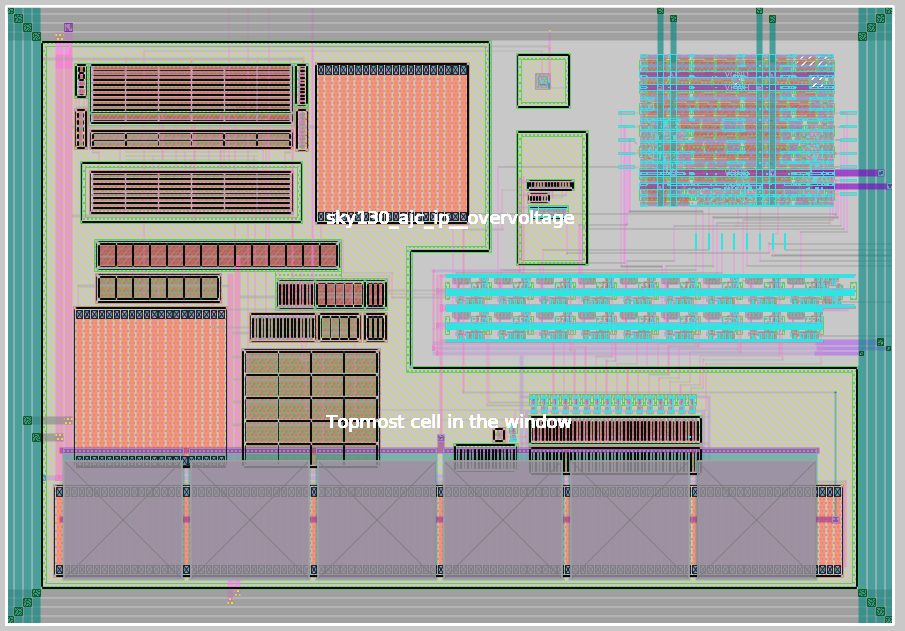

Layout of sky130_ajc_ip__overvoltage:




To perform LVS:
`netgen -batch lvs "sky130_ajc_ip__overvoltage.spice sky130_ajc_ip__overvoltage" "sky130_ajc_ip__overvoltage_lvs.xschem sky130_ajc_ip__overvoltage_lvs" /usr/local/share/pdk/sky130A/libs.tech/netgen/sky130A_setup.tcl`


```
Contents of circuit 1:  Circuit: 'sky130_ajc_ip__overvoltage'
Circuit sky130_ajc_ip__overvoltage contains 139 device instances.
  Class: sky130_fd_pr__nfet_01v8 instances:  14
  Class: overvoltage_dig       instances:   1
  Class: sky130_fd_pr__cap_mim_m3_2 instances:   1
  Class: sky130_fd_sc_hd__inv_4 instances:   1
  Class: sky130_fd_pr__pnp_05v5_W0p68L0p68 instances:   1
  Class: schmitt_trigger       instances:   1
  Class: sky130_fd_sc_hvl__lsbufhv2lv_1 instances:   1
  Class: sky130_fd_pr__nfet_g5v0d10v5 instances:  33
  Class: sky130_fd_sc_hvl__inv_1 instances:  17
  Class: sky130_fd_sc_hd__inv_16 instances:   1
  Class: sky130_fd_sc_hvl__lsbuflv2hv_1 instances:  18
  Class: sky130_fd_pr__res_xhigh_po_1p41 instances:  18
  Class: sky130_fd_pr__pfet_g5v0d10v5 instances:  31
  Class: ibias_gen             instances:   1
Circuit contains 98 nets.
Contents of circuit 2:  Circuit: 'sky130_ajc_ip__overvoltage_lvs'
Circuit sky130_ajc_ip__overvoltage_lvs contains 133 device instances.
  Class: sky130_fd_pr__nfet_01v8 instances:   8
  Class: overvoltage_dig       instances:   1
  Class: sky130_fd_pr__cap_mim_m3_2 instances:   1
  Class: sky130_fd_sc_hd__inv_4 instances:   1
  Class: sky130_fd_pr__pnp_05v5_W0p68L0p68 instances:   1
  Class: schmitt_trigger       instances:   1
  Class: sky130_fd_sc_hvl__lsbufhv2lv_1 instances:   1
  Class: sky130_fd_pr__nfet_g5v0d10v5 instances:  33
  Class: sky130_fd_sc_hvl__inv_1 instances:  17
  Class: sky130_fd_sc_hd__inv_16 instances:   1
  Class: sky130_fd_sc_hvl__lsbuflv2hv_1 instances:  18
  Class: sky130_fd_pr__res_xhigh_po_1p41 instances:  18
  Class: sky130_fd_pr__pfet_g5v0d10v5 instances:  31
  Class: ibias_gen             instances:   1
Circuit contains 102 nets.

Circuit was modified by parallel/series device merging.
New circuit summary:

Contents of circuit 1:  Circuit: 'sky130_ajc_ip__overvoltage'
Circuit sky130_ajc_ip__overvoltage contains 133 device instances.
  Class: sky130_fd_pr__nfet_01v8 instances:   8
  Class: overvoltage_dig       instances:   1
  Class: sky130_fd_pr__cap_mim_m3_2 instances:   1
  Class: sky130_fd_sc_hd__inv_4 instances:   1
  Class: sky130_fd_pr__pnp_05v5_W0p68L0p68 instances:   1
  Class: schmitt_trigger       instances:   1
  Class: sky130_fd_sc_hvl__lsbufhv2lv_1 instances:   1
  Class: sky130_fd_pr__nfet_g5v0d10v5 instances:  33
  Class: sky130_fd_sc_hvl__inv_1 instances:  17
  Class: sky130_fd_sc_hd__inv_16 instances:   1
  Class: sky130_fd_sc_hvl__lsbuflv2hv_1 instances:  18
  Class: sky130_fd_pr__res_xhigh_po_1p41 instances:  18
  Class: sky130_fd_pr__pfet_g5v0d10v5 instances:  31
  Class: ibias_gen             instances:   1
Circuit contains 98 nets.
Contents of circuit 2:  Circuit: 'sky130_ajc_ip__overvoltage_lvs'
Circuit sky130_ajc_ip__overvoltage_lvs contains 133 device instances.
  Class: sky130_fd_pr__nfet_01v8 instances:   8
  Class: overvoltage_dig       instances:   1
  Class: sky130_fd_pr__cap_mim_m3_2 instances:   1
  Class: sky130_fd_sc_hd__inv_4 instances:   1
  Class: sky130_fd_pr__pnp_05v5_W0p68L0p68 instances:   1
  Class: schmitt_trigger       instances:   1
  Class: sky130_fd_sc_hvl__lsbufhv2lv_1 instances:   1
  Class: sky130_fd_pr__nfet_g5v0d10v5 instances:  33
  Class: sky130_fd_sc_hvl__inv_1 instances:  17
  Class: sky130_fd_sc_hd__inv_16 instances:   1
  Class: sky130_fd_sc_hvl__lsbuflv2hv_1 instances:  18
  Class: sky130_fd_pr__res_xhigh_po_1p41 instances:  18
  Class: sky130_fd_pr__pfet_g5v0d10v5 instances:  31
  Class: ibias_gen             instances:   1
Circuit contains 102 nets.

Circuit 1 contains 133 devices, Circuit 2 contains 133 devices.
Circuit 1 contains 98 nets,    Circuit 2 contains 98 nets.


Final result: 
Circuits match uniquely.
.
Logging to file "comp.out" disabled
LVS Done.
```

```
name=overvoltage_ana only_toplevel=false value="

.include mag/rcx/overvoltage_ana_rcx.spice

xIana otrip_decoded[14] otrip_decoded[13] otrip_decoded[11]
+ otrip_decoded[10] otrip_decoded[1] otrip_decoded[0] ena itest ibg_200n otrip_decoded[7]
+ otrip_decoded[4] vbg_1v2 vin isrc_sel otrip_decoded[5] otrip_decoded[8] otrip_decoded[2]
+ ovout otrip_decoded[15] otrip_decoded[9] otrip_decoded[12] otrip_decoded[3] otrip_decoded[6]
+ avss dvdd dvss avdd overvoltage_ana_rcx
"
```
